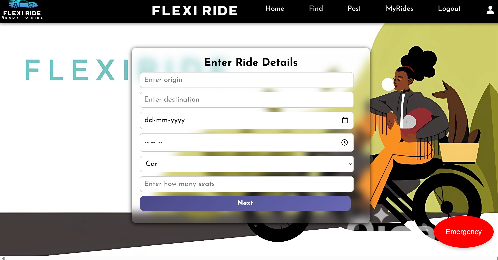
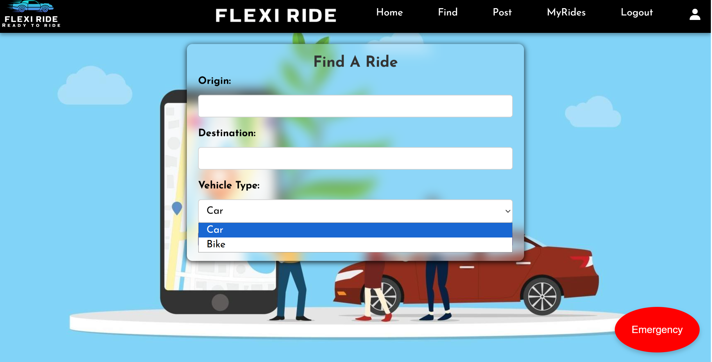
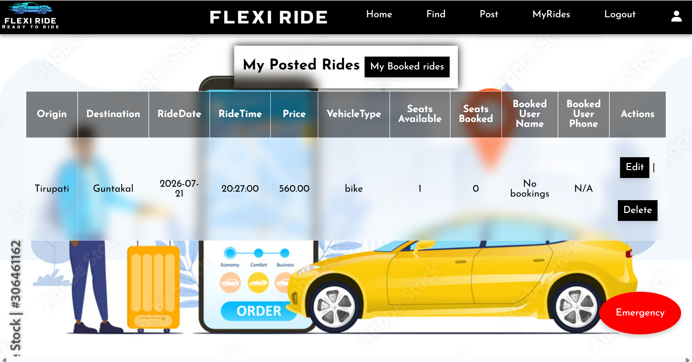

# 🚗 FlexiRide

A full-stack ride-sharing web application that connects drivers and passengers for safe, affordable, and convenient travel. Users can post rides, search for available rides, book seats, manage their rides, and use emergency safety features.

---

## 📖 Overview

FlexiRide is a PHP and MySQL-based ride-sharing platform inspired by services like BlaBlaCar. It provides an easy way for users to share rides while incorporating features such as profile management, OTP-based password recovery, emergency assistance, ride booking, feedback collection, and an admin dashboard.

---

## ✨ Features

### 👤 User Module
- User Registration & Login
- Secure Authentication
- Profile Management
- Upload Profile Photo
- Forgot Password using OTP
- Logout

### 🚘 Ride Management
- Post a Ride
- Find Available Rides
- Book Ride
- View Booked Rides
- Edit Ride Details
- Delete Ride
- Mark Ride as Reached
- View My Posted Rides

### 🛡️ Safety Features
- Emergency SOS (Danger Button)
- Emergency Email Notifications
- User Verification
- Privacy Policy

### ⭐ Feedback & Queries
- Submit Feedback
- Contact/Queries Module

### 👨‍💼 Admin Module
- Admin Login
- Admin Dashboard
- Manage Users
- Edit User Details
- Delete Users
- View User Feedback
- View User Queries

---

## 🛠️ Tech Stack

### Frontend
- HTML5
- CSS3
- JavaScript

### Backend
- PHP

### Database
- MySQL

### Libraries
- PHPMailer
- Composer

---

## 📂 Project Structure

```
FlexiRide/
│
├── images/
├── uploads/
├── PHPMailer/
├── vendor/
├── about.php
├── admin_dashboard.php
├── admin_manage_users.php
├── admin_edit_user.php
├── admin_delete_user.php
├── admin_feedback.php
├── admin_queries.php
├── book_ride.php
├── booking_success.php
├── danger.php
├── db.php
├── edit_profile.php
├── edit_ride.php
├── feedback.php
├── find_ride.php
├── forgot_password.php
├── forgot_otp.php
├── index.php
├── login.php
├── logout.php
├── myrides.php
├── my_booked_rides.php
├── otp_verify.php
├── post_ride.php
├── privacy.php
├── profile.php
├── queries.php
├── reached.php
├── rides.php
├── ride_output.php
├── ride_success.php
├── upload_photo.php
├── view_photos.php
├── blablacar_clone.sql
└── README.md
```

---

## 🗄️ Database

Database Name:

```
blablacar_clone
```

Import the provided SQL file before running the application.

---

## 🚀 Installation

1. Install XAMPP.
2. Start Apache and MySQL.
3. Copy the project into:

```
C:\xampp\htdocs\
```

4. Open phpMyAdmin.
5. Create a database named:

```
blablacar_clone
```

6. Import:

```
blablacar_clone.sql
```

7. Update the database credentials in:

```
db.php
```

8. Open your browser:

```
http://localhost/FlexiRide
```

---

## 📸 Screenshots

Create a folder named:

```
screenshots/
```







```

---

## 🔒 Security

- Password Hashing
- Session Authentication
- OTP Password Recovery
- Prepared SQL Statements
- Input Validation

---

## 🎯 Future Enhancements

- Google Maps Integration
- Live GPS Tracking
- Ride Ratings & Reviews
- AI-based Ride Recommendations
- Real-time Notifications
- Mobile Application

---

## 👨‍💻 Author

**Kona Aravind Ranga Reddy**

B.Tech – Artificial Intelligence & Machine Learning

GitHub: https://github.com/aravindkona18090

---

## 📄 License

This project is developed for educational and portfolio purposes.